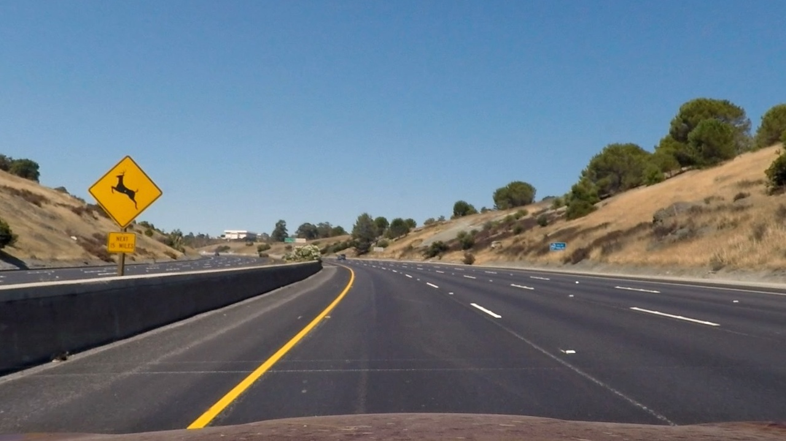

# **Advanced Lane Finding on Road** 

## Writeup by Hussain Dudekula

---

**Advanced Lane Finding Project**

The goals / steps of this project are the following:

* Compute the camera calibration matrix and distortion coefficients given a set of chessboard images.
* Apply a distortion correction to raw images.
* Use color transforms, gradients, etc., to create a thresholded binary image.
* Apply a perspective transform to rectify binary image ("birds-eye view").
* Detect lane pixels and fit to find the lane boundary.
* Determine the curvature of the lane and vehicle position with respect to center.
* Warp the detected lane boundaries back onto the original image.
* Output visual display of the lane boundaries and numerical estimation of lane curvature and vehicle position.

[//]: # (Image References)

[image1]: ./examples/undistort_output.png "Undistorted"
[image2]: ./test_images/test1.jpg "Road Transformed"
[image3]: ./examples/binary_combo_example.jpg "Binary Example"
[image4]: ./examples/warped_straight_lines.jpg "Warp Example"
[image5]: ./examples/color_fit_lines.jpg "Fit Visual"
[image6]: ./examples/example_output.jpg "Output"
[video1]: ./project_video.mp4 "Video"

---

### Camera Calibration

#### 1. Briefly state how you computed the camera matrix and distortion coefficients. Provide an example of a distortion corrected calibration image.

The code for this is present in the file `./code/camera_calibration.py` in the function `calibrate` at line 28. The camera matrix and distortion coefficients are calculated at line 51. The steps for the computation are:

First, `object_points` are generated which are the (x, y, z) coordinates of the chessboard corners in the world. Here it is assumed that the chessboard is fixed on (x, y) plane at z = 0, such that the object points are the same for each calibration image. Therefore, `object_point` is generated once and it's elements are appended to `object_points` every time chessboard corners are successfully detected in a test image. `image_points` is append with (x, y) pixel position of each of the corners in the image plane with each successful chessboard detection.

Then the output `object_points` and `image_points` are used to compute the camera calibration matrix and distortion coefficients using `cv2.calibrateCamera()` function. The matrix and coefficients are stored as class variables `camera_matrix` and `distortion_coeff`.

In order to apply distortion correction to a test image. `undistort` function present at line 78 is used. The function makes use of `cv2.undistort()` and gets the images.

    
    

*The left image shows the original image and the right image shows the undistorted version*

    
    

*The left image shows the original image and the right image shows the undistorted version*

### Pipeline (single images)

#### **1. Provide an example of a distortion-corrected image.**

The test image taken is the following:

    

The distortion corrected image is the following:

    

#### **2. Describe how (and identify where in your code) you used color transforms, gradients or other methods to create a thresholded binary image.  Provide an example of a binary image result.**

The code for this step is present in the file `./code/image_transformation.py`. The function `binary_pipeline_image` at line 46 contains the code for the same. For this step, a combination of color and gradient thresholds is used to generate the binary image. There are 3 main thresholds that are used, which are:

- A gradient based threshold has been applied on the grayscale version of the image
- A color based threshold has been applied on the Red Color channel of the image
- A color based threshold has been applied on the S channel of the HLS colorspace

An example of a binary image is as follows:

    
    

*Blue color shows the gradient threshold. Green color shows the Red color channel. Red color shows the S channel*

#### **3. Describe how (and identify where in your code) you performed a perspective transform and provide an example of a transformed image.**

The code for perspective transform is present in the file `./code/image_transformation.py`. The function `transform_pipeline_image` at line 99 contains the code for the same. The destination and source points have been hardcoded by inspection. These points work generally for all the test images and the video.

The source and destination points are:

| Source        | Destination   | 
|:-------------:|:-------------:| 
| 580, 450      | 256, 0        | 
| 100, 700      | 256, 720      |
| 1200, 700     | 1024, 720      |
| 770, 450      | 1024, 0        |

The perspective transform has been verified by testing on test images. Following are the results:

    
    

    
    

#### **4. Describe how (and identify where in your code) you identified lane-line pixels and fit their positions with a polynomial?**

The lane line pixel detection is done in the file `./code/lane_detection.py` in the function `_calculate_lane_pixels()` and `_recalculate_line_pixels()` at lines 75 and lines 144. The first function calculates the lane pixels for the first time and the second function recalculates it based on the previous calculations.

For the first time, the lane pixels are calculated using Sliding Windows Approach. To start, a histogram of number of pixels is generated and divided into left and right halves. The position of maximum pixels is choosen as the starting point of the lanes. Then, using the sliding windows approach non zero pixels are identified sequentially.

For the recalculation, the polynomial that was fit earlier is used to guide the search for further pixels. The next nonzero pixels are identified around a certain margin of the polynomial that was fit earlier.

Some examples are:

    
    

#### **5. Describe how (and identify where in your code) you calculated the radius of curvature of the lane and the position of the vehicle with respect to center.**

This is done in the file `./code/lane_detection.py`. The function `_calculate_curvature` at line 239 does the task. First the parameters to convert from pixels to meters is derived. Then the curvature for both the left and right polynomials are calculated using the formula and evaluated at the bottom most point.

For the center, the difference between the actual center of the image and the center of the lanes is required. The center of the lanes is calculated in the file `./code/lane_detection.py` in the function `_calculate_curvature` at line 239. This is done by evaluating the values of the left and right polynomials and taking their average. The actual center is simply the center of the image in horizontal direction. The rest of the calculation is done in `./code/main.py` at line 42.

#### **6. Provide an example image of your result plotted back down onto the road such that the lane area is identified clearly.**

This step has been implemented in the file `./code/image_transformation.py`. The function `untransform_pipeline_image` at line 157 does the work. The function takes two images, `image` and `original_image` which are the lane detected RGB image and the original image to show on respectively. The following is an example on a test image:

    
    

---

### Pipeline (video)

#### **1. Provide a link to your final video output.  Your pipeline should perform reasonably well on the entire project video (wobbly lines are ok but no catastrophic failures that would cause the car to drive off the road!).**

Here's the [link to video result](./test_videos_output/project_video.mp4)

---

### Discussion

#### **1. Briefly discuss any problems / issues you faced in your implementation of this project.  Where will your pipeline likely fail?  What could you do to make it more robust?**

The main problem with the implementation of this project was the tuning part. Selecting the right thresholds for gradient and color thresholding took the most effort. Adjusting the parameters to work for all variations of light and shadow was difficult to adjust. Adjustment of parameters for lane detection was also difficult.

The pipeline would most certainly fail with a high change in the light or shadow. This would result in a different color that may not be able to get captured in the threshold. Some similar colored stray lines would also affect the pipeline. In addition to that, the pipeline would also not work really well with very sharp turns.

To make it more robust, a dynamic adjustment of parameters could be introduced. To deal with sharp turns, a shorter ROI could be set.